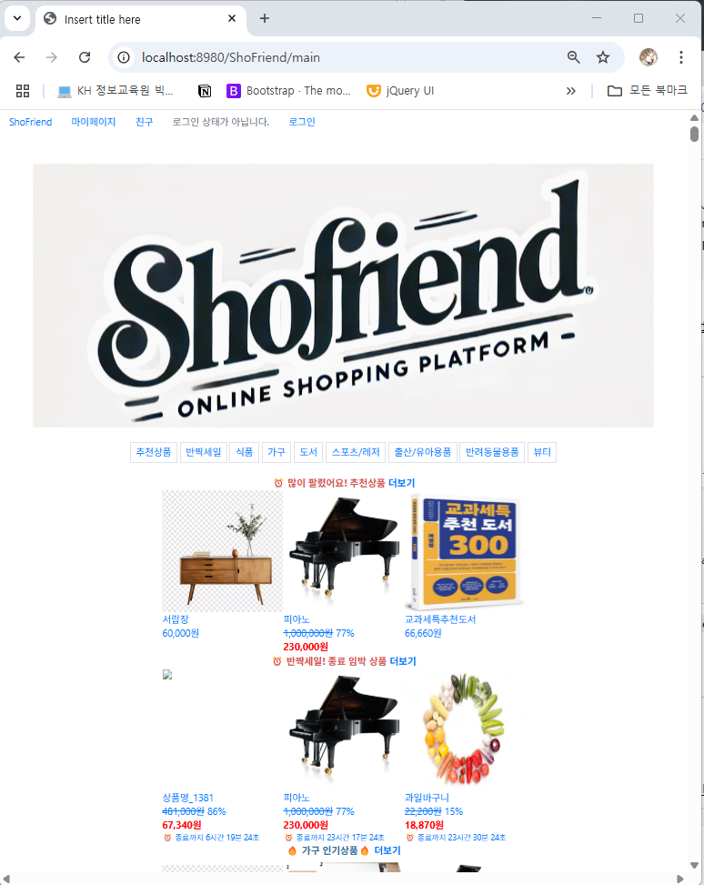
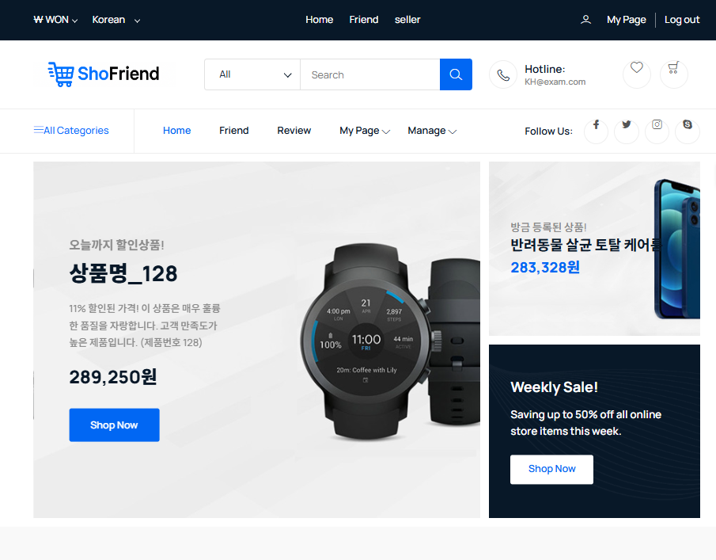
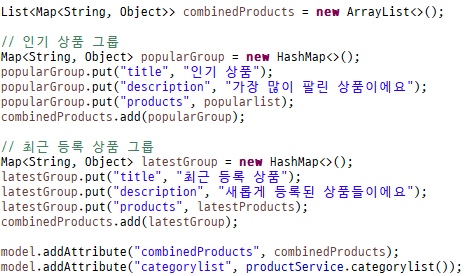
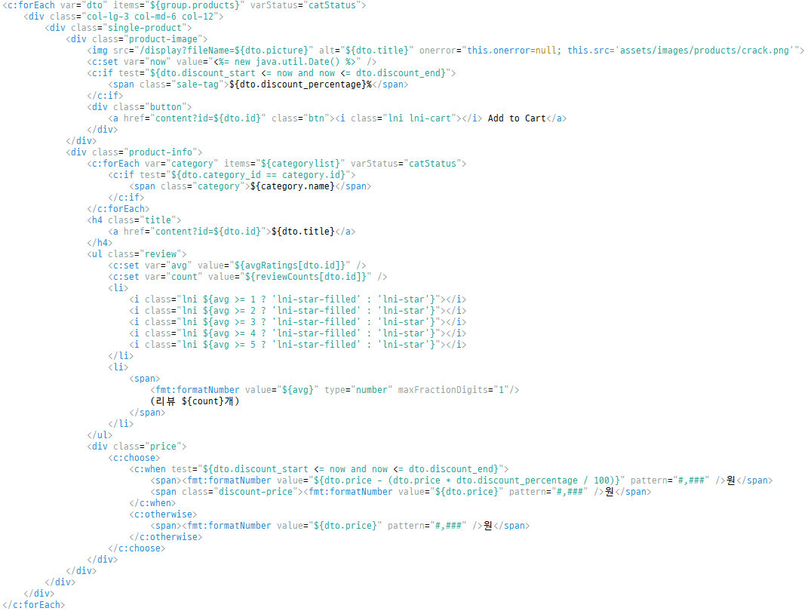
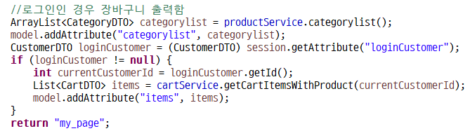

# 🛍️ 친구와 함께 쇼핑해요! SHOFRIEND

**Spring Boot 기반 온라인 상품 판매 플랫폼**
팀원분들과 함께 만든 최종본은 [[여기를](https://github.com/Wjyuy/ShoFriend_Final)] 참고해주세요! 

<br>
이 페이지는 작성자가 제작한 부분들과 마주한 경험, 배움들을 작성한 페이지입니다 😊
<br>
저는 이번 프로젝트를 진행하면서 전체 프로젝트 마이그레이션, 메인페이지 리팩토링, 친구기능 제작, 장바구니 결제, 카카오페이 api 등을 구현하였습니다!

## 프로젝트 포스터


## 기술 구상도

  ### 사용 기술 스택
  * **Backend:** Spring Boot
  * **Database:** MySQL
  * **ORM:** MyBatis
  * **Version Control:** Git, Sourcetree
  * **Build Tool:** Gradle
  * **Web Server:** Tomcat
  * **Communication:** Slack, Jira

## Spring Boot에서 구현한 Spring Security구현 과정
  프로젝트에서 Spring Security는 시간관계상 사용하지 못했지만, 미리 적용해 본 경험을 작성

### 기본 설정 및 구성

1.  **Spring Boot 프로젝트 생성**
    *   **Project**: Gradle
    *   **Language**: Java
    *   **Spring Boot**: 최신 버전
    *   **Dependencies**: 'Spring Web', 'Spring Security'
    *   **Generate** 버튼 클릭하여 프로젝트 생성
    *   생성된 프로젝트를 IDE (Eclipse)로 불러온다

2.  **Spring Security 설정**
    *   **기본 보안 설정** : `application.properties`에 기본 보안 설정을 추가(기본 로그인 페이지를 비활성화하거나 특정 경로에 대한 인증 설정)

        ```properties
        # application.properties 파일 예시
        spring.security.user.name=user
        spring.security.user.password=password
        ```

    *   **Custom Security Configuration** (본 프로젝트에서는 적용하지 못 했지만, 더 복잡한 보안 설정은 `SecurityConfig` 클래스를 작성해 세부 설정 커스터마이징 가능 : 특정 URL 패턴 접근 제어, 사용자 정의 로그인 페이지 설정 등)

        ```java
        import org.springframework.context.annotation.Bean;
        import org.springframework.context.annotation.Configuration;
        import org.springframework.security.config.annotation.web.builders.HttpSecurity;
        import org.springframework.security.config.annotation.web.builders.AuthenticationManagerBuilder;
        import org.springframework.security.config.annotation.web.configuration.EnableWebSecurity;
        import org.springframework.security.config.annotation.web.configuration.WebSecurityConfigurerAdapter;
        import org.springframework.security.core.userdetails.User;
        import org.springframework.security.core.userdetails.UserDetailsService;
        import org.springframework.security.provisioning.InMemoryUserDetailsManager;

        @Configuration
        @EnableWebSecurity
        public class SecurityConfig extends WebSecurityConfigurerAdapter {

            @Override
            protected void configure(HttpSecurity http) throws Exception {
                http
                    .authorizeRequests()
                    .antMatchers("/public/**").permitAll() // 공용 경로 
                    .anyRequest().authenticated() // 나머지 요청은 인증 필요 
                    .and()
                    .formLogin()
                    .loginPage("/login")
                    .permitAll()
                    .and()
                    .logout() 
                    .permitAll();
            }

            @Override
            @Bean
            public UserDetailsService userDetailsService() {
                UserDetailsService userDetailsService = new InMemoryUserDetailsManager(); // 인메모리 사용자 정보 서비스 
                userDetailsService.createUser(User.withUsername("user").password("{noop}password").roles("USER").build()); // 사용자 생성
                return userDetailsService;
            }
        }
        ```
        위 예제에서는 `/public/**` 경로는 인증 없이 접근 가능, 나머지 경로는 인증 요구.

3.  **사용자 인증과 권한 부여** : `UserDetailsService` 구현하여 사용자 정보 제공 ( 다음 프로젝트에서는 데이터베이스와 연동하여 볼 예정)

    *   **UserDetailsService 예제** :

        ```java
        import org.springframework.security.core.userdetails.UserDetails;
        import org.springframework.security.core.userdetails.UserDetailsService;
        import org.springframework.security.core.userdetails.UsernameNotFoundException;
        import org.springframework.stereotype.Service;
        import org.springframework.security.core.userdetails.User; // User 클래스

        @Service
        public class CustomUserDetailsService implements UserDetailsService {

            @Override
            public UserDetails loadUserByUsername(String username) throws UsernameNotFoundException {
                // DB 로직
                if ("user".equals(username)) { // "user" 이름 처리 
                    return User.withUsername("user")
                               .password("{noop}password") // {noop} 필요 
                               .roles("USER")
                               .build();
                } else {
                    throw new UsernameNotFoundException("User not found"); // 사용자 없을 시 예외 발생 
                }
            }
        }
        ```
        예제는 사용자 이름이 "user"인 경우만 처리하며, 실제 환경에서는 데이터베이스에서 사용자 정보를 조회해야 한다

### 에러 처리 및 해결 방법

*   **에러: 403 Forbidden**
    *   **해결 방법**:
        1.  `HttpSecurity` 설정에서 URL 패턴, 권한 설정 확인
        2.  로그인 페이지나 로그인 처리 올바른지 확인
        ```java
        @Override protected void configure(HttpSecurity http) throws Exception {
            http
                .authorizeRequests()
                .antMatchers("/public/**").permitAll() // 확인
                .anyRequest().authenticated() // 확인
                .and()
                .formLogin()
                .loginPage("/login") // 확인
                .permitAll()
                .and()
                .logout()
                .permitAll();
        }
        ```
## Spring legacy -> Spring boot 마이그레이션 과정

  ### 1. 스프링 부트 의존성 추가

  *   Gradle 프로젝트 : `build.gradle` 파일에 스프링 부트 플러그인 및 관련 의존성 추가
      *   `id 'org.springframework.boot' version '2.7.13'` 버전 다운
      *   `implementation 'org.mybatis.spring.boot:mybatis-spring-boot-starter:2.3.1'` 버전 다운
      *   `implementation 'org.springframework.boot:spring-boot-starter-web'` 추가
      *   `implementation 'javax.servlet:jstl:1.2'` 추가


  * 기존 Spring legacy의 pom.xml

    ```xml
      <java-version>11</java-version>
      <org.springframework-version>5.0.7.RELEASE</org.springframework-version>
      <org.aspectj-version>1.6.10</org.aspectj-version>
      <org.slf4j-version>1.6.6</org.slf4j-version>
    </properties>
    <dependencies>
      <!-- Spring -->
      <dependency>
        <groupId>org.springframework</groupId>
        <artifactId>spring-context</artifactId>
        <version>${org.springframework-version}</version>
        <exclusions>
          <!-- Exclude Commons Logging in favor of SLF4j -->
          <exclusion>
            <groupId>commons-logging</groupId>
            <artifactId>commons-logging</artifactId>
          </exclusion>
        </exclusions>
      </dependency>
      <dependency>
        <groupId>org.springframework</groupId>
        <artifactId>spring-webmvc</artifactId>
        <version>${org.springframework-version}</version>
      </dependency>
  ```
  
  * 변경된 Spring boot Gradle 설정

  ```gradle
  plugins {
    id 'java'
  //	id 'org.springframework.boot' version '3.4.4'
    id 'org.springframework.boot' version '2.7.13'
    id 'io.spring.dependency-management' version '1.1.7'
  }
  dependencies {
    implementation 'org.springframework.boot:spring-boot-starter-web'
    //	implementation 'org.mybatis.spring.boot:mybatis-spring-boot-starter:3.0.4'
    implementation 'org.mybatis.spring.boot:mybatis-spring-boot-starter:2.3.1'
    implementation 'org.apache.tomcat.embed:tomcat-embed-jasper'
    implementation 'javax.servlet:jstl:1.2'
    implementation group: 'net.coobird', name: 'thumbnailator', version: '0.4.20'
    implementation 'org.bgee.log4jdbc-log4j2:log4jdbc-log4j2-jdbc4.1:1.16'
    compileOnly 'org.projectlombok:lombok'
    developmentOnly 'org.springframework.boot:spring-boot-devtools'
    runtimeOnly 'com.mysql:mysql-connector-j'
    annotationProcessor 'org.projectlombok:lombok'
    testImplementation 'org.springframework.boot:spring-boot-starter-test'
    testImplementation 'org.mybatis.spring.boot:mybatis-spring-boot-starter-test:3.0.4'
    testRuntimeOnly 'org.junit.platform:junit-platform-launcher'
    //25.05.08 홍길동 websocket 의존성 추가 (채팅 기능에 필요)
    implementation 'org.springframework.boot:spring-boot-starter-websocket'
    //25.05.08 홍길동 카카오페이용 의존성 추가 
    implementation 'org.apache.httpcomponents:httpclient'
    implementation 'com.fasterxml.jackson.core:jackson-databind'
  }
  ```

  ### 2. 중복 레거시 의존성 제거
  * `spring-boot-starter-web` 스타터에 이미 포함되어 있는 의존성들 (예: spring-context, spring-webmvc, spring-tx, spring-orm, tomcat-dbcp, javax.servlet-api, javax.servlet.jsp 등) 제거
  ### 3. @SpringBootApplication 클래스 생성
  * 스프링 부트 애플리케이션 시작점 역할인 메인 클래스 생성, `@SpringBootApplication 어노테이션` 추가
      *   이 어노테이션은 `@Configuration`, `@EnableAutoConfiguration`, `@ComponentScan` 세 가지 어노테이션을 결합한 것으로, 스프링 빈 구성 정의, 스프링 부트 자동 구성 활성화, 지정된 패키지 및 하위 패키지에서 스프링 컴포넌트 스캔 활성화 등의 기능을 자동으로 처리
  ### 4. XML 설정 파일 마이그레이션
  * 스프링 레거시에서 XML로 관리되던 설정들을 스프링 부트 방식`application.properties/application.yml`으로 전환

  * 기존 Spring legacy의 servlet-context.xml 
  ```xml
	<!-- Resolves views selected for rendering by @Controllers to .jsp resources in the /WEB-INF/views directory -->
	<beans:bean class="org.springframework.web.servlet.view.InternalResourceViewResolver">
		<beans:property name="prefix" value="/WEB-INF/views/" />
		<beans:property name="suffix" value=".jsp" />
	</beans:bean>
	
	<context:component-scan base-package="com.lgy.ShoFriend" />
	
	<!-- 	dataSource 객체는 데이터베이스 정보 포함 -->
	<beans:bean name="dataSource" class="org.springframework.jdbc.datasource.DriverManagerDataSource">
		<beans:property name="driverClassName" value="com.mysql.cj.jdbc.Driver"></beans:property>
		<beans:property name="url" value="jdbc:mysql://localhost:3306/atom"></beans:property>
		<beans:property name="username" value="bts"></beans:property>
		<beans:property name="password" value="1234"></beans:property>
	</beans:bean>

	<beans:bean id="sqlSessionFactory" class="org.mybatis.spring.SqlSessionFactoryBean">
		<beans:property name="dataSource" ref="dataSource"></beans:property>
		<!-- 		sql 로 구성된 xml 경로 설정 -->
		<beans:property name="mapperLocations" value="classpath:com/lgy/ShoFriend/dao/mapper/*.xml"></beans:property>
	</beans:bean>
	
	<!-- 	SqlSessionTemplate 타입의 sqlSession 객체는 sqlSessionFactory 객체를 포함한다. -->
	<beans:bean id="sqlSession" class="org.mybatis.spring.SqlSessionTemplate">
		<beans:constructor-arg index="0" ref="sqlSessionFactory"></beans:constructor-arg>
	</beans:bean>	
	
	<!-- 	2025.04.08 파일입출력 홍길동  -->
	<beans:bean id="multipartResolver" class="org.springframework.web.multipart.commons.CommonsMultipartResolver">
		<beans:property name="defaultEncoding" value="UTF-8"/>
		<beans:property name="maxUploadSize" value="10485760"/>
	</beans:bean>
  ```

  * 변경된 Spring boot application.properties

  ```xml
	spring.application.name=boot_shofriend
  server.port=8485

  #Server
  server.servlet.session.timeout=30m

  #Spring MVC
  spring.mvc.view.prefix=/WEB-INF/views/
  spring.mvc.view.suffix=.jsp

  #Database config
  #spring.datasource.driver-class-name=com.mysql.cj.jdbc.Driver
  spring.datasource.driver-class-name=net.sf.log4jdbc.sql.jdbcapi.DriverSpy
  #spring.datasource.url=jdbc:mysql://localhost:3306/atom
  spring.datasource.url=jdbc:log4jdbc:mysql://localhost:3306/atom
  spring.datasource.username=bts
  spring.datasource.password=1234

  #mybatis config
  mybatis.config-location=classpath:mybatis-config.xml

  spring.mvc.static-locations=classpath:/static/,file:C:/develop/upload/
  logging.level.org.springframework.web.client=DEBUG

  ```
  ### 5. 데이터 접근(DAO/Mapper) 구조 마이그레이션
  * 레거시의 DAO/매퍼 구조를 스프링 부트 환경에 맞게 설정
      *   **데이터 소스 설정**: 데이터베이스 연결 설정은 JNDI 대신 `application.properties/application.yml` 또는 `@Configuration` 클래스에서 `DataSource` 빈을 직접 설정하는 방식으로 변경
      *   **Mapper 프레임워크 설정**:`MyBatis-Spring Boot Starter` 추가, 스프링 부트 설정에 맞게 \src\main\resources\mybatis\mappers 위치에, mybatis-config.xml 으로 설정정
  ### 6. 파일 위치, package에 따른 파일명 재설정
  * 레거시의 DTO/Controller/Service/ServiceImpl 구조를 스프링 부트 환경에 맞게 설정

  ### 마이그레이션 완료된 Spring boot 디렉토리 구조
  ```text
    Shofriend
    ├── build.gradle
    ├── src
    │   └── main
    │       ├── java
    │       │   ├── com.boot.controller
    │       │   ├── com.boot.dao
    │       │   ├── com.boot.dto
    │       │   ├── com.boot.service
    │       │   └── com.boot.websocket
    │       ├── resources
    │       │   ├── application.properties
    │       │   ├── mybatis-config.xml
    │       │   └── mybatis.mapper
    │       └── webapp
    │           └── WEB-INF
    │               └── views
    └── ⋮ (etc files/directories)
  ```

## 메인페이지 리팩토링
  * 스프링 프로젝트 자체를 바꾸면서 프론트 디자인, 페이지 구조도 리팩토링 진행

  <table>
    <tr>
      <td align="center">(전) legacy버전 main</td>
      <td align="center">(후) boot버전 main</td>
    </tr>
    <tr>
      <td></td>
      <td></td>
    </tr>
  </table>

  * 기존에는 model 에 각각의 list를 보내어 JSP 에서 출력할 때 여러 블록 단위를 사용해 출력
    * 유지보수 시, 모든 블록단위를 수정하는 문제 발생
  * 변경 후, MAP 으로 list들을 Group으로 묶어 보냄
    * 구조적으로 안정적
    * 메인화면에 출력을 유동적으로 설정 가능

  <table>
    <tr>
      <td align="center">Controller</td>
      <td align="center">JSP</td>
    </tr>
    <tr>
      <td></td>
      <td></td>
    </tr>
  </table>

## 결제 기능
  * 장바구니 결제 전, 단품 결제 먼저 카카오페이 api를 활용하여 구현
    * kakaopay developers와 kakao developers의 aid, test key 오인하는 실수
    * Postman 활용하여 서버쪽 처리
    * 

  <table>
    <tr>
      <td align="center">JSP이동 Controller</td>
      <td align="center">카카오페이에 필요한 파라미터 redirect</td>
    </tr>
    <tr>
      <td></td>
      <td></td>
    </tr>
    <tr>
      <td align="center">카카오페이 Service</td>
      <td align="center">결제성공 후 처리</td>
    </tr>
    <tr>
      <td></td>
      <td></td>
    </tr>
  </table>

  * 장바구니 결제 구현
    * 미리 제작하였던 단품결제와 기능을 합치기 위한 고민 존재
    * DB에서 상품을 보내면, 장바구니에서 수정한 내용들이 반영되지 않음
    * 따라서 배열로 장바구니에 담긴 상품들을 보내는 방향으로 결정
    * JS로 데이터를 전송하기 위해, 인코딩 방식을 변경
  * Header에 장바구니 Hover 이벤트 구현
    * 전 페이지의 Header에 장바구니를 적용하여 사용자UI에 편리성 추가
    * 전 페이지 수정을 하며, 유지보수 측면에서 페이지를 효율적으로 나누자고 다짐

  <table>
    <tr>
      <td align="center">JS에서 상품id,수량 배열전송</td>
      <td align="center">배열 전송 인코딩 방식 설정</td>
    </tr>
    <tr>
      <td></td>
      <td></td>
    </tr>
    <tr>
      <td align="center">Controller도 배열[]로 수정</td>
      <td align="center">가격계산도 배열만큼 반복</td>
    </tr>
    <tr>
      <td></td>
      <td></td>
    </tr>
    <tr>
      <td align="center">장바구니 결제완료 시 장바구니에서 삭제</td>
      <td align="center">전 페이지에서 hover 이벤트 위해 모델전송</td>
    </tr>
    <tr>
      <td></td>
      <td></td>
    </tr>
  </table>


## 🔗 관련 링크

  * **발표자료**

  <a href="./img/pptx.pdf" download="document.pdf">PDF 미리보기</a>
  [최신 발표 자료 다운로드 (릴리스)](https://github.com/Wjyuy/ShoFriend_Final/releases/latest)

  * **시연영상 보기**

  [](https://www.youtube.com/watch?v=2gDThXVyRGg)